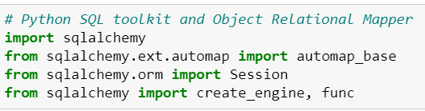

# sqlAlchemy-challenge
 Climate Analysis & Data Exploration
# Climate_Data_Exploration__Analysis
 Analysis and exploration of a climate database

# Explore
let's dive into the climate changes for the best holiday

### 1 Introduction 

- We have been provided with sqlite database conatining some climate information for a location.Our task is to explore that data further.

- Our analysis aims to provide a better understanding of the climatic data so we can plan the holiday better and be well-prepared for what climatic conditions we might have to face at that location. This will make our holiday smoother and enjoyable.

- For accompalishing the above tasks We will be making use of the Jupyter Notebook in order to explore the data and will also be creating a "Flask app" to display the information in json format using API.

### 2 Prerequisites

-  Primarily we will be using Python and SQLAlchemy for the basic analysis and data exploration of our climate database.

-  To be more specific, we use SQLAlchemy ORM queries, Pandas, and Matplotlib.

### 3 Exploring the Climate Data

#### 3.1 Connection to Database

Using the SQLAlchemy create_engine() function in order to connect to my SQLite database.

Use the SQLAlchemy automap_base() function to reflect my tables into classes, and then saving the references to the classes namely station and measurement.

Creating a link between Python and my database by creating a SQLAlchemy session.

#### 3.2 Inspection of Tables

We get two tables after inspecting the database and below is a representation of how the first ten (10) rows of each table looks like:

##### 3.2.1 Measurement Table

##### 3.2.2 Station Table

### 4 Exploratory Analysis

Then we proceed to perform an analysis for the precipitation and station tables.

#### 4.1 Precipitation Analysis

Precipitation analysis using the bar plot exhibits the summary of the percipitation data. (Sorted by Date)

#### 4.2 Station Analysis

Station analysis shows the temperature observations of the data for the period (August 2016 to August 2017). 

### 5 Flask API for Climate Data

After exploring the above tables we move on to working with Flask. I created an app.py using falsk app. Here I created multiple routes each of which will yield a different output.

I used the Flask jasonify () function in order to convert the API data to a valid json response object.

Below is a brief description of each of the routes:

- Home Route:

The home route contains a list of the below routes:

f"Available Routes: "
        f"/api/v1.0/precipitation "
        f"/api/v1.0/stations "
        f"/api/v1.0/tobs "
        f"/api/v1.0/start (enter as YYYY-MM-DD) "
        f"/api/v1.0/start/end (enter as YYYY-MM-DD/YYYY-MM-DD)"

- Precipitation Route:

This route basically converts the query results from our precipitation analysis (i.e. grabs only the last 12 months of the data) into a dictionary where date is the key and prcp is the value in the key/value pairs.

- Stations Route:

This route extracts the list of stations from our dataset.

- Temperature Observations Route:

This route queries the temperature and date readings corresponding to the most acive stations for the data of the previous year.

- Dynamic route for Start/End date:

This gives a JSON list comprising of the minimum temperature, the average temperature, and the maximum temperature for a particular start or start-end range.

Also when the user inputs a date which does not fall in the specified accepted range of dates, an error message will be displayed.

- Conclusion:

With our analysis above we can be more informed and hence plan our holidays in a better way and make that time more enjoyable and free of any hurdles.

